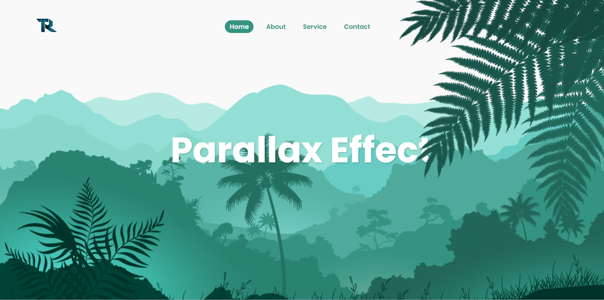

# Effet Parallax au scroll




## Fonctionnalités

- Effet parallax basé sur le mouvement de la souris.
- Compatible avec les navigateurs modernes.
- Facile à intégrer dans n'importe quel projet web.

## Technologies utilisées

- HTML
- CSS
- JavaScript

## Installation

Pour dzécouvrir cet effet parallax sur un site web statique  :

Clonez ce dépôt dans votre projet :

    ```
    git clone https://github.com/votre-utilisateur/effet-parallax.git
    ```


